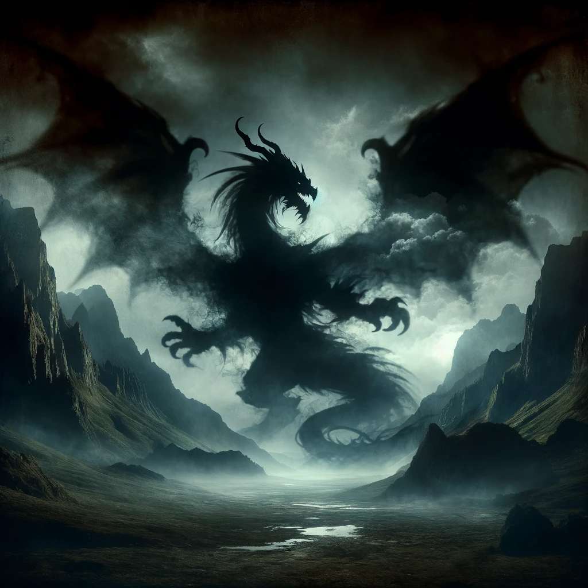

# Geeni

## Beschreibung

Geeni, der uralte schwarze Drache, einst gefürchtet für seine zerstörerische Macht und unerbittlichen Zorn, hat sich im Laufe der Jahrhunderte von der Welt zurückgezogen. Verborgen in den Tiefen finsterer Höhlen und abgeschiedener Berge, entkam er der Jagd und Furcht der Menschen und anderer Kreaturen. Doch im Schatten seiner Einsamkeit wandelte sich Geenis Perspektive nicht zu Güte oder Weisheit, sondern zu einer noch finsteren Form seines Wesens.

In seiner verborgenen Existenz erkannte Geeni die Verzweiflung und Rachegefühle, die in den Herzen vieler Humanoide brodelten. Anstatt ihnen aus Güte zu helfen, sah Geeni darin eine Gelegenheit, seine Macht auf eine neue, listige Weise auszuüben. Er bot diesen verzweifelten Seelen einen Pakt an: seine dunkle Macht im Austausch für ihre unerschütterliche Treue. Doch dieser Pakt war kein Geschenk, sondern ein Fluch.

Die Bedingungen des Paktes waren ebenso geheimnisvoll wie grausam. In Momenten grösster Not verloren die Betroffenen ihr Bewusstsein, und Geenis Macht übernahm die Kontrolle. Wenn sie erwachten, war die Bedrohung beseitigt, doch um welchen Preis? Sie erinnerten sich an nichts, ausser an das Bild des Schattens eines uralten schwarzen Drachen – eine düstere Erinnerung an die dunkle Kraft, die sie gerettet, aber auch an sie gebunden hatte.

Durch diese Pakte verbreitete Geeni seine dunkle Präsenz in der Welt, heimlich und still. Seine Schützlinge wurden zu Werkzeugen seiner Zerstörung, jeder Erfolg war von seinem Willen geprägt. Geeni, der einst ein Wesen der reinen Zerstörung war, wurde nun zu einem dunklen Patron, einem Symbol der Angst und Verzweiflung.

In dieser neuen Rolle thront Geeni weiterhin in den Schatten, ein unerbittlicher Herrscher der Dunkelheit, der die Schwachen und Rachesüchtigen in seinen Bann zieht und sie in die Abgründe seiner eigenen finsteren Welt hinabzieht.

## Legenden

1. **Die Versunkene Stadt**: Einst stand eine prächtige Stadt am Rande eines grossen Sees, reich und mächtig, aber ihre Herrscher waren grausam und ungerecht. Geeni, der von der Tyrannei hörte, stieg aus den Tiefen auf und umhüllte die Stadt in einer Nacht mit seinem dunklen Nebel. Am nächsten Morgen war die Stadt verschwunden, versunken im See, und nur ein schwarzer Nebelschleier blieb zurück. Man sagt, dass die Seelen der Stadtbewohner noch immer in den Tiefen gefangen sind, und dass ihre Schreie in stillen Nächten über den Wassern zu hören sind.

2. **Der Fluch des Ewigen Regens**: In einer Region, die einst von Dürre geplagt war, bat ein verzweifelter König Geeni um Hilfe. Der Drache gewährte ihm Regen, doch zu einem hohen Preis. Der Regen hörte nie wieder auf, und das Land wurde von Fluten heimgesucht. Der König wurde wahnsinnig vor Schuld, und die einst trockenen Länder wurden zu ewigen Sümpfen, in denen das Wasser ebenso schwarz ist wie Geenis Schuppen.

3. **Der Geisterwald**: Man erzählt sich von einem dichten Wald, der einst von einem bösen Hexenmeister beherrscht wurde. Als der Hexenmeister Geeni um mehr Macht bat, verwandelte der Drache den Wald in ein Reich der Schatten, in dem die Bäume selbst lebendig wurden und die Seelen derer, die sich darin verirrten, gefangen nahmen. Es heisst, dass der Hexenmeister nun als ein gesichtsloser Geist durch den Wald wandert, ewig dazu verdammt, seine eigene Grausamkeit zu erleiden.

4. **Der Schattenkönig**: Vor langer Zeit herrschte ein gerechter und geliebter König, der im Sterben lag. Sein ehrgeiziger Sohn schloss einen Pakt mit Geeni, um die Macht seines Vaters zu erben. Doch als der König starb, fiel ein ewiger Schatten über das Königreich. Der Sohn wurde zu einem Schattenkönig, unfähig, die Sonne zu sehen oder die Wärme zu fühlen, und sein Reich versank in Dunkelheit und Verzweiflung.

5. **Die Nacht der Flüsternden Schatten**: In einer mondlosen Nacht verschwanden plötzlich alle Kinder eines Dorfes. Verzweifelt suchten die Dorfbewohner und fanden heraus, dass ein junger Hexenmeister, der von Geeni in den dunklen Künsten unterrichtet wurde, hinter dem Verschwinden steckte. Er hatte die Kinder in Schatten verwandelt, die nur in der Dunkelheit existieren konnten. Jedes Jahr, in der gleichen mondlosen Nacht, hören die Dorfbewohner das Flüstern und Lachen ihrer Kinder, doch können sie sie nie wieder in ihre Arme schliessen.

## Visions

1. **Vision der Ausbreitenden Schattenflügel**: "In deinem Traum erstreckt sich ein enormer Schatten über den nachtschwarzen Himmel. Die Silhouette massiver Flügel entfaltet sich langsam, während eine eindrucksvolle Präsenz dich umgibt. Ehrfurcht und Furcht ergreifen dich gleichzeitig, bevor die Vision plötzlich endet, dich aber mit einem tiefen Gefühl der Verbindung zu einer uralten Macht zurücklässt."

2. **Vision der Glühenden Drachenaugen**: "Du findest dich in völliger Dunkelheit wieder, fixiert von zwei flammenden, durchdringenden Augen. Sie scheinen direkt in deine Seele zu blicken, dabei das Bild eines gigantischen Drachenkopfes enthüllend. Diese Augen bergen Wissen und Macht aus einer anderen Ära, und du spürst eine tiefe Verbindung zu ihrem Besitzer."

3. **Vision des Dröhnenden Echos**: "Ein tiefes, grollendes Echo hallt in deinem Bewusstsein wider, als ob es aus den Tiefen der Erde selbst käme. Du siehst das Bild eines riesigen Mauls, umgeben von bedrohlichen Zähnen. Dieses Brüllen offenbart die Macht des Drachens, Landschaften zu erschüttern und dein Herz erbeben zu lassen."

4. **Vision der Verschlingenden Dunkelheit**: "In deinem Traum erlebst du eine erstickende Dunkelheit, die alles um sich herum zu verschlingen scheint. Im Herzen dieser Finsternis erkennst du die mächtige Gestalt von Geeni. Seine Präsenz absorbiert alles Licht und Leben, ein Zeugnis seiner zerstörerischen Natur und seiner Fähigkeit, das Schicksal von Welten zu formen."

5. **Vision des Unendlichen Drachens**: "Die intensivste deiner Visionen enthüllt Geeni in seiner vollen, furchterregenden Pracht. Er erscheint als ein kolossaler Drache, dessen Körper sich wie ein Berg erstreckt, mit Schuppen, die im Dunkel funkeln. Du spürst die immense Macht und das Alter dieses Wesens, ein Zeichen seiner zeitlosen Weisheit und seines tiefen Verständnisses des Kosmos."