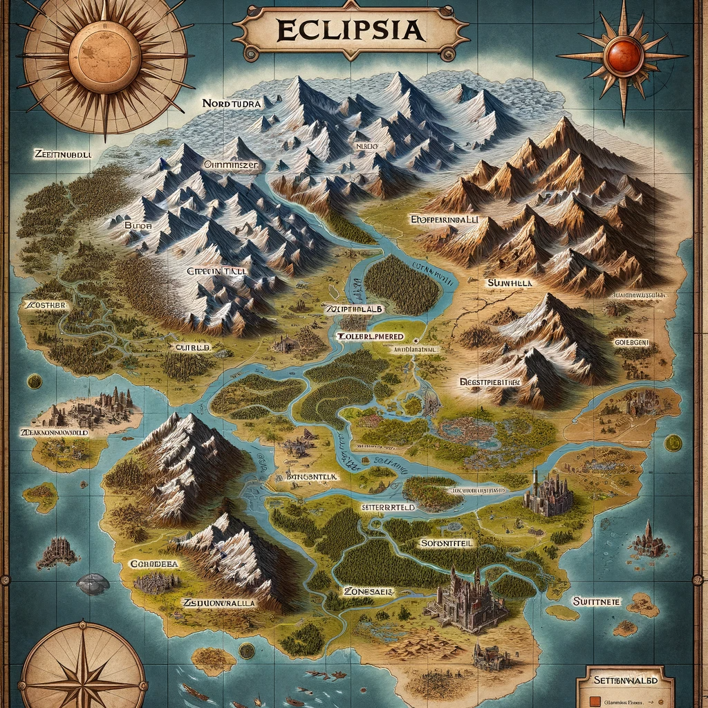

# Eclipsia

## **Regionen von Eclipsia**

1. **Norden - Eisland**:
   Eine schneebedeckte und frostige Region, bekannt für ihre eisigen Winde und schroffen Landschaften. Hier überleben nur die Hartgesottenen, und es gibt zahlreiche Legenden über verborgene Eisschätze und gefrorene Ruinen.

2. **Nord-Westen - Sumpfland**:
   Ein feuchtes und nebliges Sumpfgebiet, durchzogen von trüben Gewässern und dichtem Unterholz. Hier finden sich seltene Kräuter und gefährliche Kreaturen, die in den versteckten Tiefen des Sumpfes lauern.

3. **Nord-Osten - Felsgebirge**:
   Ein majestätisches Gebirge mit zerklüfteten Gipfeln und tiefen Tälern. Die Bergregion ist Heimat für Bergvölker und Minen, in denen wertvolle Erze und Kristalle abgebaut werden.

4. **Mitte - Grasland**:
   Ein weitläufiges Grasland mit vielen Flüssen, das ein fruchtbares und lebhaftes Ökosystem beherbergt. Hier finden sich zahlreiche Bauernhöfe, kleine Dörfer und Handelswege.

5. **Süden - Sonnenwüste**:
   Eine ausgedehnte Wüstenlandschaft mit endlosen Dünen und sengender Sonne. Die Sonnenwüste birgt viele Geheimnisse, darunter alte Ruinen und geheimnisvolle Oasen.

6. **Osten - Ödland**:
   Ein trostloses und unwirtliches Land, geprägt von kargen Felsen und spärlicher Vegetation. Hier ist das Leben eine tägliche Herausforderung, und nur die Zähesten überleben.

7. **Westen - Verbrannte Insel**:
   Eine isolierte Inselgruppe, gezeichnet von einer vergangenen Katastrophe, die das Land verwüstet hat. Die Inseln sind umgeben von rätselhaften Ruinen und Legenden über verlorene Schätze.

8. **Süd-Westen - Kleinberg**:
   Ein kleineres Gebirge mit einer reichen Vielfalt an Flora und Fauna. Die Bergregion ist weniger rau als das Felsgebirge und beherbergt eine Vielzahl von kleinen Gemeinschaften und Minen.

### **Städte**

1. **Hauptstadt - Sonnenkreuz** (zwischen Grasland und Wüste):
    Sonnenkreuz liegt am Übergang zwischen dem fruchtbaren Grasland und der rauen Sonnenwüste. Die Stadt ist ein Schmelztiegel verschiedener Kulturen und ein Zentrum des Handels und der Diplomatie.

2. **Zweitgrösste Stadt - Windhafen** (zwischen Grasland und Ödland):
   Windhafen liegt im Westen des Graslandes, nahe der Grenze zum Ödland. Die Stadt ist bekannt für ihre robusten Bauwerke, erfahrenen Händler und den Zugang zu den Ressourcen sowohl des Graslandes als auch des Ödlandes.